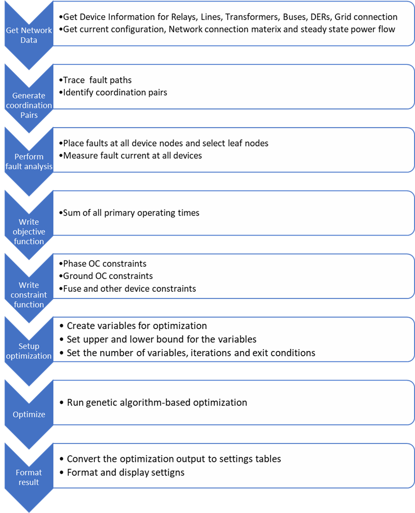

# Protection settings optimizer 

The Protection settings optimizer (PSO) is a Python package for calculating optimal protection settings for power systems protection devices such as relays and reclosers. The PSO algorithm uses supplied network data and fault analysis to generate settings with minimal operating times while maintaining coordination between protection devices. The network data is used to identify protection device coordination pairs using graph theory-based path tracing. The fault analysis provides the fault currents observed at each protection device. The fault currents and the coordination pairs are used to formulate the relay settings as a mixed integer nonlinear problem (MINLP). The MINLP is solved using a genetic algorithm-based solver. The figure below provides an overview of the protection settings optimizer process.



### Installation

```sh
python -m pip install git+https://github.com/sandialabs/Protection-settings-optimizer.git
```

# Optimizer input Data and format

## 1) System information
The system information required to run the settings optimizer can be obtained in the following methods 
<details>
<summary> 1) Json Format</summary>
The system information can be imported using a JSON file. The JSON file must contain at least the following information with the labels shown below:

 1. Relays/Reclosers
    * Name: Relay Name
    * Bus1: From Bus
    * Bus2: To Bus
    * MonitoredObj: Name of branch connecting Bus1 and Bus2
    * Enabled: True or False
 2. Lines
    * Name: Name of Line
    * Bus1: From Bus
    * Bus2: To bus
    * Enabled: True or False
    * numPhases: number of phases
    * Length: Line length
    * Rpu: perunit line resistacne
    * Xpu: per-unit line  reactance
 3. XFMRS
    * Name: Name of Transformer
    * Bus1: From Bus
    * Bus2: To bus
    * Enabled: True or false
    * nunPhases: number of phases
    * Rpu: perunit resistacne
    * Xpu: per-unit  reactance
 4. Buses
    * Name: Bus name
    * numPhases: number of phases
    * kV: Bus nominal Line-ground voltage in kV (optional)
    * x: x coordinate for plotting (optional)
    * y: y coordinate for plotting (optional)
 5. Pvs
    * Name: Name of PV generation
    * Bus: Location of PV generation
    * Enabled: True or False
    * numPhases: Number of phases
 6. BESS
    * Name: Name of Battery Energy Storage System (BESS)
    * Bus: Location of Battery
    * Enabled: True or False
    * numPhases: Number of phases
 7. Gens
    * Name: Name of the generator (traditional or distributed)
    * Bus: Loacaation of generator
    * Enabled: True or False
    * numPhases: Number of phases
</details>

<details>
<summary>2) Import from OpenDSS</summary>
The system information can be obtained from OpenDSS directly using the COM interface. The following code can be used to start OpenDSS and request the required system information.   

```
import os
import RSO_pack
import win32com.client

# Start OpenDSS
dssObj = win32com.client.Dispatch("OpenDSSEngine.DSS")
dssText = dssObj.Text
dssCircuit = dssObj.ActiveCircuit
dssSolution = dssCircuit.Solution
dssElem = dssCircuit.ActiveCktElement
dssBus = dssCircuit.ActiveBus
 
# Start Run IEEE 34 bus system
dssText.Command = 'clear'
dssText.Command = 'compile 'Path to OpenDss file'
dssText.command = 'set maxcontroliter = 500'
dssText.Command = 'solve'

# collect system info from OpenDSS
SysInfo = RSO_pack.getSysInfo(dssCircuit)
```
</details>

<details>
<summary> 3) RONM json File</summary>
The system information can also be parsed from the RONM Output using the code below. 

```
# Load RONM output 
jsonFile = "loaction of RONM output json file" 
f = open(jsonFile) 
jsonDict = json.load(f)
f.close()

# Get SysInfo from Json
proSettings = jsonDict['Protection settings']
powerFlow = jsonDict['Powerflow output']
SysInfo = RSO_pack.getRONMSysInfo(proSettings,powerFlow)
```
The RONM output must contain the necessary system information in 'Protection settings/network_model'.
</details>

<details>
<summary> 4) Simplified RAVENS format</summary>
The system information can also be parsed from the simplified RAVENS Output using the code below. 

```
# Load RAVENS File 
RAVENS_File = "Simplified_RAVENS.json"
with open(RAVENS_File,'r') as file :
    data = json.load(file)

# Get SysInfo from Json
SysInfo = RSO_pack.get_system_Data_RAVENS(data,Step_num)
```
The RAVENS output must contain the necessary system information in the simplified RAVENS format.
The simplified version of the RAVENS file can be obtained using the following code
```
w2PL = wire2PL("RAVENS.json","Simplified_RAVENS.json")
```

</details>

## 2) load-flow/steady-state data
The protection settings optimizer requires the steady state/load flow data to calculate settings.
The steady-state information can be obtained from the following sources:
<details>
<summary> 1) CSV File</summary>
A ".CSV" file containing the following information for each protection device:

 1. Device index
 2. Phasors
    * [Va,Vb,Vc,Ia,Ib,Ic]
    * Voltages in volts
    * Currents in Amps
    * angles in radians
 3. Digital: Protection device breaker status
    * 1: closed
    * 0: Open
 4. Per phase real power

### Example CSV format 
|  | RelayName | phasors | digital | RealPower |
|---|---|---|---|---|
| 0 | SEL-751-1 | [(2330.68, 2.46),(2370.47, 0.39),(2355.01,-1.70),(426.32,2.25),(255.44,0.18),(310.66,-1.89)] | [1] | [971748.37, 591362.89, 717722.91] |

</details>

<details>
<summary> 2)  Import from OpenDSS</summary>
The steady-state/load flow information can be obtained from OpenDSS directly using the COM interface using the code below. 

```
%% collect steady state Data
Buses = SysInfo['Buses']
devLines = [x['MonitoredObj'].split('line.')[1] for x in SysInfo['Relays']]+[x['MonitoredObj'].split('line.')[1] for x in SysInfo['Recs']]
devNames = [x['Name'] for x in SysInfo['Relays']]+[x['Name'] for x in SysInfo['Recs']]
dev_BusV = [Buses[RSO_pack.index_dict(Buses,'Name',x['Bus1'])]['kV']*1e3 for x in SysInfo['Relays'] ]+[Buses[RSO_pack.index_dict(Buses,'Name',x['Bus1'])]['kV']*1e3 for x in SysInfo['Recs'] ]

Device_Data_CSV = RSO_pack.getDeviceData(dssCircuit,devNames,devLines,dev_BusV)
```
</details>

<details>
<summary> 3) Import from RONM</summary>
The steady-state/load flow information for each timestep included in the RONM output can be obtained from the "Powerflow output/protection" section. 
The section must contain an entry for each protection device for each time step.
Each device entry must contain the following:
 1. voltage (kV) : Voltage magnitude
 2. phi (deg) : Voltage angle
 3. real power flow (kW) 
 4. reactive power flow (kVar)

The following code can be used to obtain the steady-state values.
```
proSettings = jsonDict['Protection settings']
powerFlow = jsonDict['Powerflow output']

SysInfo = RSO_pack.getRONMSysInfo(proSettings,powerFlow,ignore_fuse=True)
# Get Timeline Data form Json
devTimeLine = jsonDict['Device action timeline']
(sW_Status,sW_Names) = RSO_pack.get_Sw_Status(jsonDict['Powerflow output'],devTimeLine)

# %% Calculate devie Data 
Buses = SysInfo['Buses']
Relay_list = [x['MonitoredObj'].split('line.')[1] for x in SysInfo['Relays']] 
Reclo_list = [x['MonitoredObj'].split('line.')[1] for x in SysInfo['Recs']]
Fuses_list = [x['MonitoredObj'].split('line.')[1] for x in SysInfo['Fuses']]
devTypes = ['relay']*len(Relay_list)+['recloser']*len(Reclo_list)+['fuse']*len(Fuses_list)
devLines = Relay_list+Reclo_list+Fuses_list
devNames = [x['Name'] for x in SysInfo['Relays']]+[x['Name'] for x in SysInfo['Recs']]+[x['Name'] for x in SysInfo['Fuses']]
dev_BusV = [Buses[RSO_pack.index_dict(Buses,'Name',x['Bus1'])]['kV']*1e3 for x in SysInfo['Relays']]+[Buses[RSO_pack.index_dict(Buses,'Name',x['Bus1'])]['kV']*1e3 for x in SysInfo['Recs']]+[Buses[RSO_pack.index_dict(Buses,'Name',x['Bus1'])]['kV']*1e3 for x in SysInfo['Fuses']]

# create settings list 
settings = []*len(devTimeLine)

# %% itterate per step   
for Ts in range(len(devTimeLine)):
    print('------======'+str(Ts)+'======------\n')
    # get switch states
    switchLines = sW_Names
    switchStates = sW_Status[Ts]
    # Collect Load Flow Deta 
    Device_Data_CSV = RSO_pack.getRONMDeviceData(Ts,powerFlow,devTypes,devNames,devLines,dev_BusV,SysInfo,sW_Status,sW_Names)
```
</details>

<details>
<summary> 4) Import from RAVENS </summary>
The steady-state/load flow information for each timestep included in the RAVENS output can be obtained from the "AnalysisResult" section using the following code

```

Device_Data_CSV =RSO_pack.get_Device_Data_RAVENS(data,SysInfo,Step_num)

```
</details>

## Fault Data
The protection settings optimizer requires fault analysis data to calculate the protection settings. Similarly to the system information and steady-state data, one of three methods can be used to import fault data.
<details>
<summary> 1) Import from CSV</summary>
A ".CSV" file containing the following information for each fault at each protection device can be used to import the fault data.

 1. Fault Loaction (Fault bus)
 2. Relay Name
 3. Fault Type
 4. |Ia| (A)
 5. &ang; Ia (deg)
 6. |Ib| (A)
 5. &ang; Ib (deg)
 6. |Ic| (A)
 7. &ang; Ic (deg)
 8. |Va|
 9. &ang; Va
 10. |Vb|
 11. &ang; Vb
 12. |Vc|
 13. &ang; Vc
 14. 3*|I0|
 15. &ang; I0 

### Example CSV format 
| 1 | R1 | TPH_R1 | 2163.90 | -47.351 | 2163.90 | -167.35 | 2163.90 | 72.6486 | 0.92238 | -44.907 | 0.92238 | -164.91 | 0.92238 | 75.0927 | 0 | 0 |
|---|---|---|---|---|---|---|---|---|---|---|---|---|---|---|---|---|
| 1 | R2 | TPH_R1 | 7.4E-12 | 0 | 7.4E-12 | 0 | 7.4E-12 | 0 | 0.90096 | -47.351 | 0.90096 | -167.35 | 0.90096 | 72.6486 | 0 | 0 |
| 1 | R3 | TPH_R1 | 7.2E-12 | 0 | 7.2E-12 | 0 | 7.2E-12 | 0 | 0.90096 | -47.351 | 0.90096 | -167.35 | 0.90096 | 72.6486 | 0 | 0 |
</details>
<details>
<summary> 2) Simulate and Import from OpenDSS</summary>
The fault analysis information can be obtained from OpenDSS directly using the COM interface using the code below. The code simulates the necessary faults in OpenDSS and collects the fault currents observed by each device in the system for each fault.

```
Buses = SysInfo['Buses']

# %% collect fault Data 
faultBuses = [x['Name'] for x in Buses]
faultBusPhases = [None]*len(faultBuses)
for ii in range(len(faultBuses)):
    faultBusPhases[ii] = Buses[RSO_pack.index_dict(Buses,'Name',faultBuses[ii])]['nodes']

Fres = ['0.001','1']
Fts = ['3ph','SLG','LL']

FData = RSO_pack.getFaultInfo(dssCircuit,dssText,faultBuses,faultBusPhases,Fres,Fts,devLines,devNames,dev_BusV)
Fault_File_loc = pwd+'FData.csv'
FData.to_csv(Fault_File_loc,index=False,header=False)
Fault_Data_CSV = RSO_pack.read_Fault_CSV_Data(Fault_File_loc)
```
</details>
<details>
<summary> 3) Import from RONM</summary>
The fault information for each timestep should be included in the RONM output under the "Fault currents" section. 
The section must contain an entry for each fault and the voltages and currents observed by each device for the faults.
Each device entry must contain the following:
 1. |V| (V) : Voltage magnitude
 2. phi (deg) : Voltage angle
 3. |I| (A) : Current magnitude  
 4. theta (deg): Voltage angle
 5. |I0| (A) : Zero sequence current
 6. |I1| (A) : Positive sequence current
 7. |I2| (A) : Negative sequence current

The following code can be used to read the fault analysis data from the RONM output.
```
# collect Fault Data
    faultBuses = list(jsonDict['Fault currents'][1].keys())
    faultBusesLOC = faultBuses
    faultBusPhases = [None]*len(faultBuses)
    for ii in range(len(faultBuses)):
        faultBusPhases[ii] = Buses[RSO_pack.index_dict(Buses,'Name',faultBuses[ii])]['nodes']

Fault_Data_CSV = RSO_pack.getRONMFaultData(Ts, faultBuses, devTypes, devNames, devLines, dev_BusV, jsonDict['Fault currents'][Ts])
```
</details>

<details>
 
<summary> 
 4) Import from RAVENS
</summary>
The fault information for each fault must be included in the RAVENS output under the "AnalysisResult" section. 
The section must contain an entry for each fault and the voltages and currents observed by each device for the faults.

The following code can be used to read the fault analysis data from the RONM output.
```
# collect Fault Data
FData = pd.DataFrame(RSO_pack.get_fault_data_RAVENS(data,Step_num))
Fault_File_loc = os.path.join(pwd,'FData.csv')
FData.to_csv(Fault_File_loc,index=False,header=False)
Fault_Data_CSV = RSO_pack.read_Fault_CSV_Data(Fault_File_loc)
```
</details>

# Setting optimizer main function 
The primary function used to calculate the protection settings is "runSettingsOptimizer." The function calculates the optimized relay settings using the supplied network, steady-state, and fault data. The function also has some additional options and inputs outlined below.

* Main_dir: The main directory containing the  "RSO_pack" folder and the files used to import the network, steady-state, and fault data.
* switchStates: switch states for each switch in the system (1: Closed, 0: Open)
* switchLines: Name of lines with switches 
* Device_Data_CSV: Formatted steady-state data
* Fault_Data_CSV: Formatted fault data
* Fault_Res: Faut resistance as a list in increasing order (Example: ['R0_1', 'R1'])
* SysInfo: Formated system inforamtion
* Substation_bus: Main substation (used to determine the start of the system)
* Min_Ip: Minimum allowable pick value in primary amps
* enableIT: True - Allow instantaneous trip if applicable, False - Disable  instantaneous trip
* Force_NOIBR: True - Force optimizer to ignore the distributed generation and nondirectional output settings; false - calculate directional overcurrent settings. 
* CTI: Desired coordiantion time interval
* OTMax: Maximum allowable operating Time in seconds
* type_select: Enable relay type selection
* SetDir: Output directional setting 
* Sho_Plots: Enable plotting of system layout and optimization process 
* GA_initial_seed: Optional input to initialize the optimization with predetermined values

### Example protection settings optimizer call  
```
settings,old_info = RSO_pack.runSettingsOptimizer(Main_dir,
                                                  switchStates,
                                                  switchLines,
                                                  Device_Data_CSV,
                                                  Fault_Data_CSV,
                                                  Fault_Res,
                                                  SysInfo,
                                                  Substation_bus,
                                                  Min_Ip,
                                                  enableIT,
                                                  Force_NOIBR,
                                                  CTI,
                                                  OTmax,
                                                  type_select,
                                                  SetDir,
                                                  Sho_Plots,
                                                  GA_initial_seed=initpop)
```

## Examples 

### Cape/".CSV" Example
The Protection settings optimizer can be used with CAPE. PSS CAPE can be used to output device information and fault analysis needed by PSO as "CSV" files. The device status information file must contain a list of devices with their steady-state voltages, currents, and breaker status. An example file named "outputV1_624.csv" is provided, showing the data format required. An example fault data file named "fault_report_624.csv," which contains the fault analysis, is also provided as part of the example. A system information file containing the system configuration, layout, Bus information, Line information, transformer information, protection device information, and generation resource information is required. An example system information file named "IEEE123_Sysinfo.json" containing information for the IEEE 123 system is provided as part of the example. To run the setting optimizer using the data obtained from PSS@CAPE run the "CAPE_Example.py"

### OpenDSS Example
The Protection settings optimizer contains the code required to connect to OpenDSS and retrieve all necessary information to calculate relay settings. PSO utilizes the OpenDSS COM interface to obtain the required system information. PSO can also use a compiled and solved case to obtain the necessary device information and perform the fault analysis. An example integration with OpenDSS is provided in "Opendss_Example.py." This example will start OpenDSS compile the IEEE34bus system, solve the power flow and perform fault analysis to collect required device information for the optimization process.

### RONM Example

Resilient Operation of Networked Microgrids (RONM) uses "PowerModelsONM," an optimization library for operating and restoring electric power distribution feeders featuring networked microgrids. PowerModelsONM can be configured to output the necessary information to run the PSO. The outputs from the PowerModelsONM can be configured to output the system information, device information, and fault studies. The outputs are read by the PSO and used to calculate relay settings for each state the grid transitions through over the entire timeframe in the RONM output. An example integration with RONM output can be run using the "RONM_Example.py."
